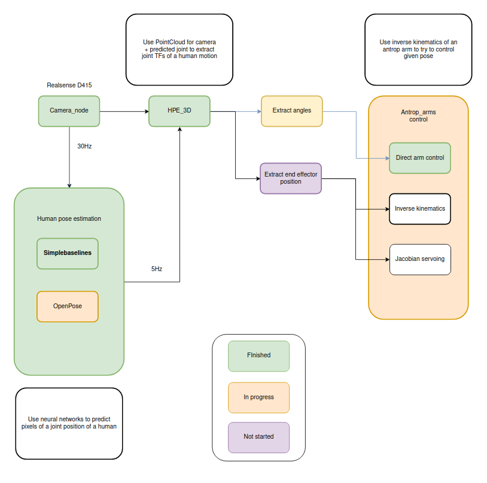

# hpe_ros_package


ROS package for human pose estimation with [Microsoft SimpleBaselines](https://github.com/microsoft/human-pose-estimation.pytorch) algorithm.


### Starting procedure

Start camera, for 3D pose estimation start realsense in realsense docker: 
```
roslaunch realsense2_camera rs_rgbd.launch 
```

### HMI starting procedure 

Start HPE3d: 
``` 
roslaunch hpe_ros_package hpe_3d.launch
```

Currently HPE3d includes following: 
 * depth_extraction_node --> gets 3D point of each human joint 
 * hpe_to_cmd_node --> creates arm cmd from 3D HPE points

### System architecture 



Initial draft of system architecture is shown on Figure 1., most
interesting problems are: 
 1. mapping (how to map human arm motion to robot arm motion) 
 2. compliance (force control during object interraction) 
 3. how to extract data from human pose estimation 
 4. how to implement dynamic motion primitives to learn robot arm movement


## Rest of the code for acore and epfl experiments can be found [here](https://github.com/fzoric8/hpe_ros_package). 

Code for the acore and EPFL experiments contains decoupled launch files for easier debugging. 


### TODO High priority: 

 - [x] Try 3d pose estimation (2D + depth)
 - [x] Publish Cartesian tooltip position (r_wrist, l_wrist) 
 - [x] Integrate with [antrop_arms](https://github.com/larics/antrop_arms_ros)
 - [x] Finish depth control (pitch/depth control)
 - [ ] Implement inverse kinematics
 - [ ] Find appropriate filtering method 
 - [ ] Incoroporate with aerial manipulator control 
