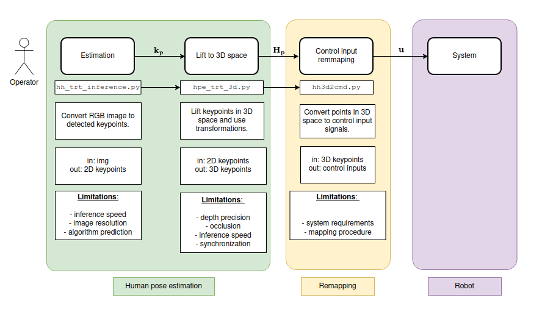

# hpe_ros_package


ROS package for human pose estimation with [Microsoft SimpleBaselines](https://github.com/microsoft/human-pose-estimation.pytorch) algorithm.

### System visualization 

ž
### Start camera

Realsense [use realsense docker]: 
```
roslaunch realsense2_camera rs_rgbd.launch 
```

Luxonis [use depthai docker] 
```
roslaunch depthai_ros_driver camera.launch 
```

Note: set `rs_compat:=true` before launching for luxonis. 

### Launch trt human pose estimation 

If you want to launch human pose estimation run: 
```
roslaunch hpe_ros_package hpe_trt_inference.launch 
```

If you want to launch hand pose estimation:
```
roslaunch hpe_ros_package hand_trt_inference.launch 
```

### Launch human pose and hand estimation 

If you want to launch human pose estimation and hand pose estimation simultaneously run: 
```
roslaunch hpe_ros_package hh_trt_inference.launch
```

## TODO: 

- [x] Publish HPE predictions in the image space
- [x] Fix indexing of the HPE predictions in the image space
- [x] Lift predictions to the 3D space using camera depth
- [x] Add init remapping
- [x] Add message syncronizer for the depth and estimate 
- [ ] Add more complex remapping for different systems 
- [ ] Check measuremet precision 
- [ ] Filter measurements with Kalman and check which indexing is used
- [ ] Publish Hand predictions in the image space

